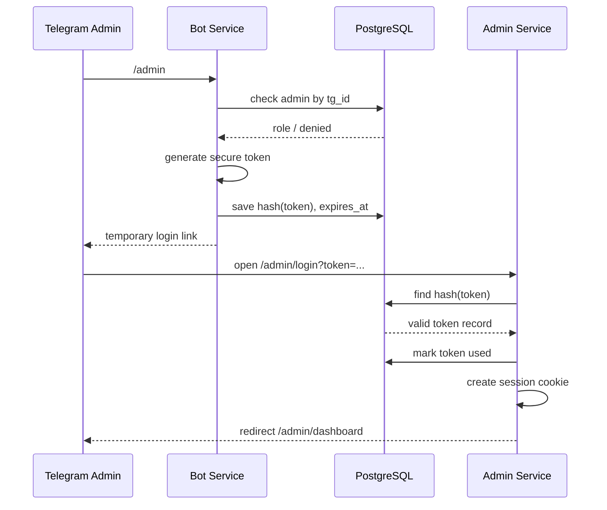
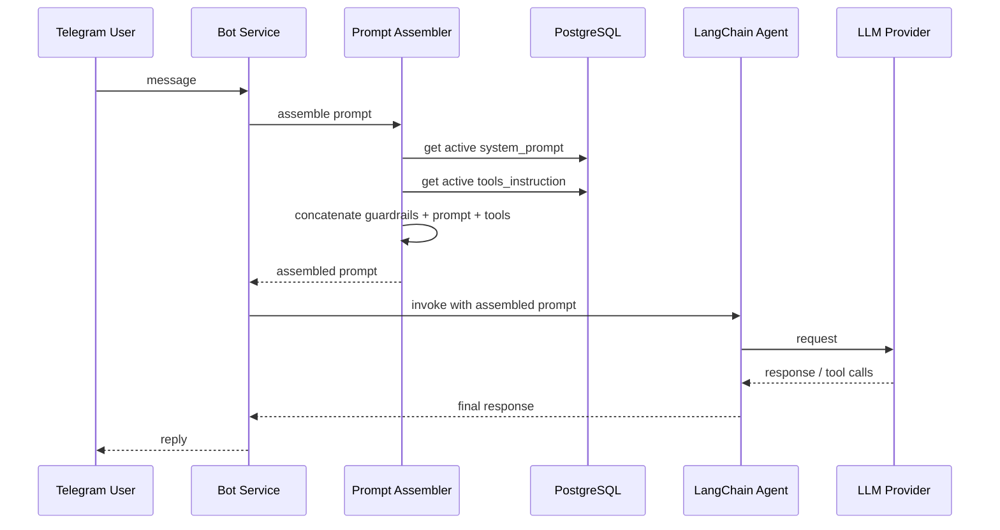

# Design: AI Assistant Template Architecture

## Overview

This document describes the architecture and design decisions for the reusable AI assistant deployment template.

## Repository Structure

```text
ai-assistant-template/
├── apps/
│   ├── bot/
│   │   ├── app/
│   │   │   ├── agent/
│   │   │   │   ├── core_guardrails.md
│   │   │   │   ├── agent.py
│   │   │   │   ├── prompt_assembler.py
│   │   │   │   └── tools/
│   │   │   │       ├── __init__.py
│   │   │   │       ├── send_to_admin.py        (REQUIRED default tool)
│   │   │   │       ├── save_lead.py             (stub)
│   │   │   │       ├── get_project_knowledge.py (stub)
│   │   │   │       └── create_followup_task.py  (stub)
│   │   │   ├── handlers/
│   │   │   │   ├── start.py
│   │   │   │   ├── admin.py
│   │   │   │   ├── message.py
│   │   │   │   └── voice.py
│   │   │   ├── services/
│   │   │   │   ├── admin_service.py
│   │   │   │   ├── prompt_service.py
│   │   │   │   ├── token_service.py
│   │   │   │   ├── audit_service.py
│   │   │   │   ├── censor_service.py
│   │   │   │   └── stt/
│   │   │   │       ├── __init__.py
│   │   │   │       ├── base.py              (STT provider interface)
│   │   │   │       ├── openai_stt.py        (primary)
│   │   │   │       └── aisha_stt.py         (fallback)
│   │   │   ├── db/
│   │   │   │   ├── models.py
│   │   │   │   ├── session.py
│   │   │   │   └── repositories/
│   │   │   ├── config.py
│   │   │   └── main.py
│   │   ├── Dockerfile
│   │   └── requirements.txt
│   │
│   └── admin/
│       ├── app/
│       │   ├── routers/
│       │   │   ├── auth.py
│       │   │   ├── dashboard.py
│       │   │   ├── system_prompt.py
│       │   │   ├── tools_instruction.py
│       │   │   ├── censor.py
│       │   │   ├── admins.py
│       │   │   └── debug.py
│       │   ├── templates/
│       │   ├── services/
│       │   ├── db/
│       │   ├── config.py
│       │   └── main.py
│       ├── Dockerfile
│       └── requirements.txt
│
├── packages/
│   └── shared/
│       ├── models/
│       ├── schemas/
│       ├── utils/
│       └── __init__.py
│
├── infra/
│   ├── docker-compose.yml
│   └── Caddyfile.example
│
├── migrations/
│   ├── env.py
│   ├── alembic.ini
│   └── versions/
│
├── scripts/
│   └── init_project_env.py
│
├── openspec/
│
├── .env.example
└── README.md
```

## Component Architecture

### 1. Bot Service (`apps/bot`)

The bot service handles Telegram interactions and LangChain agent execution.

**Responsibilities:**
- Receive Telegram messages via polling or webhook.
- Authenticate admins via `/admin` command.
- Generate one-time login tokens.
- Assemble system prompt + tools instruction from DB.
- Execute LangChain agent with registered tools.
- Log tool calls and agent runs.
- Integrate with LangSmith for observability.

**Key Components:**
- `handlers/admin.py` — `/admin` command handler, token generation.
- `handlers/message.py` — user message handler, agent invocation.
- `agent/agent.py` — LangChain agent definition.
- `agent/prompt_assembler.py` — assembles core guardrails + system prompt + tools instruction.
- `agent/tools/send_to_admin.py` — REQUIRED default tool; forwards `comment` to admin chat, auto-attaches user data (tg_id, name, username, telegram_link, language_code, trace_id, timestamp).
- `agent/tools/` — individual tool implementations (stubs for `save_lead`, `get_project_knowledge`, `create_followup_task`).
- `services/prompt_service.py` — loads active prompts from DB.
- `services/token_service.py` — generates and hashes login tokens.
- `services/audit_service.py` — writes audit log entries.

### 2. Admin Service (`apps/admin`)

The admin service provides a web interface for managing prompts, tools instruction, and administrators.

**Responsibilities:**
- Authenticate admins via one-time login tokens.
- Manage session cookies.
- Display and edit system prompt with version history.
- Display and edit tools instruction with version history.
- Manage administrators (add, deactivate, change role).
- Show debug information including LangSmith status.
- Enforce role-based permissions.

**Key Components:**
- `routers/auth.py` — login via token, logout, session management.
- `routers/system_prompt.py` — view/edit/restore system prompt.
- `routers/tools_instruction.py` — view/edit/restore tools instruction.
- `routers/admins.py` — admin management CRUD.
- `routers/debug.py` — system status and LangSmith info.
- `templates/` — Jinja2 + HTMX templates.

### 3. Shared Package (`packages/shared`)

Shared code used by both bot and admin services.

**Contents:**
- SQLAlchemy models.
- Pydantic schemas.
- Common utilities (hashing, logging, settings).

### 4. Infrastructure (`infra`)

**Docker Compose:**
- Defines `bot`, `admin`, `postgres` services.
- Binds ports to `127.0.0.1` only.
- Uses project-scoped volume names.
- No Caddy container.

**Caddyfile.example:**
- Template for host-level Caddy reverse proxy configuration.

### 5. Migrations (`migrations`)

Alembic migrations for database schema management.

**Tables:**
- `admins` — administrator accounts with roles.
- `admin_login_tokens` — one-time login token hashes.
- `prompt_versions` — versioned system prompts, tools instructions, and censor prompts.
- `admin_audit_log` — audit trail for all admin actions.
- `admin_notifications` — `send_to_admin` payloads.
- `censor_runs` — censor LLM pass records.
- `app_settings` — key-value application settings (e.g. `censor_enabled`).
- `agent_runs` — optional local agent execution log.
- `tool_call_logs` — tool call details for debugging.

### 6. Scripts (`scripts`)

**`init_project_env.py`:**
- Copies `.env.example` to `.env` if missing.
- Generates `PROJECT_SLUG` if not set.
- Generates random free `BOT_HOST_PORT` and `ADMIN_HOST_PORT`.
- Generates `SESSION_SECRET`.
- Prints Caddyfile snippet for the new project.

## Data Flow

### Admin Login Flow



### Prompt Assembly Flow



## Security Design

### Authentication

- **Admin login tokens:**
  - Generated with `secrets.token_urlsafe(32)` (minimum 32 bytes entropy).
  - Stored as SHA-256 hash in `admin_login_tokens` table.
  - Single-use: `used_at` timestamp set on first use.
  - Expires after `ADMIN_LOGIN_TOKEN_TTL_MINUTES` (default 15 min).

- **Session cookies:**
  - Signed with `SESSION_SECRET` using `itsdangerous`.
  - Configurable `SESSION_COOKIE_NAME`, `SESSION_COOKIE_SECURE`, `SESSION_COOKIE_SAMESITE`.
  - Server-side session invalidation on logout.

### Authorization

Three roles with progressive permissions:

| Role | View prompts | Edit prompts | Restore versions | View admins | Manage admins |
|------|:---:|:---:|:---:|:---:|:---:|
| read | ✓ | ✗ | ✗ | ✓ | ✗ |
| write | ✓ | ✓ | ✓ | ✓ | ✗ |
| superadmin | ✓ | ✓ | ✓ | ✓ | ✓ |

**Root admin** (`ROOT_ADMIN_TG_ID` from `.env`) always has superadmin privileges, even if DB record is missing or modified.

### Secrets Protection

- Secrets are stored only in `.env` or environment variables.
- Secrets are never stored in the database.
- Secrets are never included in LangSmith metadata, tags, inputs, or outputs.
- Admin login tokens are stored only as hashes.

## Default Tool: `send_to_admin`

### Purpose

The `send_to_admin` tool is the only REQUIRED default tool shipped with the template. It is registered in the LangChain agent automatically on bot startup and needs no additional developer configuration.

### LLM-Facing Signature

```python
send_to_admin(comment: str)
```

The LLM only provides a free-form `comment`. All user identity data is injected server-side.

### Server-Side Enrichment

When the tool is invoked, the backend automatically attaches:

| Field | Source | Condition |
|-------|--------|-----------|
| `tg_id` | Telegram user object | Always |
| `first_name` | Telegram user object | If available |
| `last_name` | Telegram user object | If available |
| `username` | Telegram user object | If available |
| `telegram_link` | Derived: `https://t.me/<username>` | Only if username exists |
| `language_code` | Telegram user object | If available |
| `trace_id` | Current request context | Always |
| `timestamp` | Server clock | Always |

### Design Decisions

| Decision | Rationale |
|----------|----------|
| LLM supplies only `comment` | Reduces hallucination risk; user data is authoritative from backend |
| `telegram_link` derived server-side | LLM does not know URL scheme; backend guarantees correct format |
| Tool is REQUIRED, not optional | Every assistant template instance needs a way to forward information to admins |

### Delivery Behavior

- If `ADMIN_TELEGRAM_CHAT_ID` is configured, the tool sends the formatted message to that Telegram chat via Bot API.
- If `ADMIN_TELEGRAM_CHAT_ID` is NOT configured, the tool saves the notification to `admin_notifications` table and does NOT break the conversation.
- In both cases the notification record is persisted in `admin_notifications`.

### Internal Payload Structure

```json
{
  "tg_id": 123456789,
  "first_name": "Ivan",
  "last_name": "Ivanov",
  "username": "ivan",
  "telegram_link": "https://t.me/ivan",
  "language_code": "ru",
  "comment": "Пользователь хочет записаться на консультацию...",
  "trace_id": "...",
  "created_at": "..."
}
```

## Full Request Pipeline

```text
Telegram update
→ normalize input (text / voice / audio)
→ if voice/audio and VOICE_ENABLED=true:
      download file via Telegram Bot API
      ffmpeg normalize audio
      if audio within size/duration limits:
          OpenAI STT (primary)
          if OpenAI fails or returns empty:
              Aisha STT (fallback, primarily Uzbek)
          if both fail:
              send user-friendly failure message
      else:
          reject with limit explanation
      transcribed text → continue as regular message
→ message log (store text + voice metadata)
→ assemble prompt:
      core guardrails (from file, non-editable)
      active system prompt (from DB)
      active tools instruction (from DB)
→ LangChain agent invocation
→ tool calls if needed (including send_to_admin)
→ draft response
→ if censor enabled:
      censor LLM receives:
          original user message
          draft response
          active censor prompt
          trace_id
      censor returns final response text
      log to censor_runs
      if censor LLM fails:
          fallback: send draft response as-is
          log error to censor_runs + debug page
          continue conversation
→ final response
→ send to Telegram
→ logs / traces / LangSmith
```

### Pipeline Design Decisions

| Decision | Rationale |
|----------|----------|
| Censor failure → send draft | Technical censor error should not block user response |
| Voice temp files deleted after processing | Avoid disk accumulation; temp dir is ephemeral |
| STT provider abstracted via interface | Allows swapping/adding providers without pipeline changes |
| Voice metadata stored in message log | Enables debugging STT issues without separate table |

## Censor / Response Reviewer

### Purpose

Optional post-processing LLM layer that reviews and edits the assistant's draft response before sending to the user.

### Toggle

- Controlled by `CENSOR_ENABLED` setting in `app_settings` table.
- Default: `false`.
- Can be toggled from `/admin/censor` page.

### Censor Prompt

- Stored in `prompt_versions` with `kind = censor_prompt`.
- Same versioning mechanism as system prompt and tools instruction.
- Editable from `/admin/censor` page.
- Last 3 versions restorable.

### Censor LLM Input

The censor LLM receives:
- Original user message.
- Draft response from main agent.
- Active censor prompt.
- Trace ID (for metadata).

The censor LLM SHALL NOT receive:
- Secrets, env values, admin tokens, DB credentials.

### Censor LLM Output

Returns only the final text message for the user.

### Failure Behavior

If censor LLM fails (API error, timeout):
- **Fallback:** send the draft response as-is.
- Log error to `censor_runs` with `status='error'`.
- Log to debug page.
- Continue conversation.

Rationale: technical censor failure should not block the user from receiving a response. The draft is already a valid agent output.

### Logging

Censor runs logged to `censor_runs` table:
- `trace_id`
- `draft_response`
- `final_response`
- `censor_prompt_version`
- `censor_model`
- `status` (success / error / skipped)
- `error`
- `duration_ms`
- `created_at`

## Voice Recognition Pipeline

### Purpose

Allow users to send voice/audio messages that are transcribed to text and processed as regular messages.

### STT Providers

| Provider | Role | Notes |
|----------|------|-------|
| OpenAI STT | Primary | Uses `gpt-4o-transcribe` by default |
| Aisha STT | Fallback | Primarily for Uzbek language; API at `aisha.group` |

### Flow

1. User sends voice/audio to Telegram.
2. Bot downloads file via Telegram Bot API.
3. Bot checks size (`VOICE_MAX_AUDIO_SIZE_MB`) and duration (`VOICE_MAX_DURATION_SEC`).
4. ffmpeg normalizes audio to standard format.
5. OpenAI STT attempts transcription.
6. If OpenAI fails or returns empty → Aisha STT fallback.
7. If both fail → user-friendly failure message.
8. Transcribed text enters the regular message pipeline.
9. All temp files deleted after processing.

### Aisha Integration Notes

- API documentation: `https://aisha.group/ru/api-documentation`
- If exact endpoint/format cannot be confirmed without API key, implement provider with clear TODO and mock/test mode.
- Aisha API details SHALL be isolated in `AishaSttProvider`, not in pipeline logic.

### Docker Dependencies

- `ffmpeg` SHALL be installed in bot Dockerfile.
- `VOICE_TEMP_DIR` defaults to `/tmp/assistant-audio`.
- Temp files are ephemeral and deleted after each processing cycle.

## Observability Design

### Local Logging

- Structured JSON logs for all services.
- Every tool call logged to `tool_call_logs` table with:
  - `trace_id`, `user_tg_id`, `tool_name`, `tool_input`, `tool_output`, `status`, `error`, `duration_ms`, `created_at`.
- Every agent run logged with `trace_id`.

### LangSmith Integration

- Optional, controlled by `LANGSMITH_TRACING` env variable.
- When disabled, no LangSmith network calls required.
- When enabled:
  - Full LangChain/LangGraph run traced.
  - Metadata includes: `trace_id`, `project_slug`, `telegram_user_id`, `telegram_username`, `bot_mode`, `system_prompt_version`, `tools_instruction_version`, `assembled_prompt_hash`, `llm_provider`, `llm_model`.
  - Tags include: `project:<slug>`, `env:<env>`, `channel:telegram`, `bot-mode:<mode>` + custom `LANGSMITH_TAGS`.
  - Tool calls appear as child spans.
  - Secrets never sent to LangSmith.
- Best-effort: failures logged locally, conversations continue.

## Deployment Design

### Docker Compose

```yaml
services:
  bot:
    build: ../apps/bot
    env_file: ../.env
    ports:
      - "127.0.0.1:${BOT_HOST_PORT}:8000"
    depends_on:
      postgres:
        condition: service_healthy

  admin:
    build: ../apps/admin
    env_file: ../.env
    ports:
      - "127.0.0.1:${ADMIN_HOST_PORT}:8080"
    depends_on:
      postgres:
        condition: service_healthy

  postgres:
    image: postgres:16-alpine
    env_file: ../.env
    volumes:
      - postgres_data:/var/lib/postgresql/data
    healthcheck:
      test: ["CMD-SHELL", "pg_isready -U $${POSTGRES_USER} -d $${POSTGRES_DB}"]
      interval: 10s
      timeout: 5s
      retries: 5

volumes:
  postgres_data:
```

### External Caddy

Caddy is installed on the host and configured via Caddyfile:

```caddyfile
bot.example.com {
    reverse_proxy 127.0.0.1:18001
}

admin.example.com {
    reverse_proxy 127.0.0.1:18002
}
```

### Multi-Project Isolation

Each project has:
- Unique `COMPOSE_PROJECT_NAME` for container isolation.
- Unique `PROJECT_SLUG` for LangSmith project separation.
- Unique `BOT_HOST_PORT` and `ADMIN_HOST_PORT` to avoid port conflicts.
- Project-scoped PostgreSQL volume (via Compose project name).

## Design Decisions

| Decision | Choice | Rationale |
|----------|--------|-----------|
| Admin UI stack | FastAPI + Jinja2 + HTMX | Faster MVP, no Node build, sufficient for forms/tables |
| Caddy location | Host-level, external | One Caddy instance per VPS, simpler networking |
| Port binding | `127.0.0.1` only | Security: no direct external access to containers |
| Token storage | SHA-256 hash only | Security: raw tokens never stored |
| Prompt versioning | Append-only with restore creating new version | History never lost, full audit trail |
| Root admin | Env-based fallback | Cannot lose access even if DB is corrupted |
| LangSmith | Optional best-effort | Observability without hard dependency |
| Tools | Code-defined, not admin-editable | Security: no arbitrary code execution |
| Censor | Optional LLM post-pass, toggleable from admin | Safety without hard dependency; failure falls back to draft |
| Voice STT | OpenAI primary, Aisha fallback | Covers Russian + Uzbek; provider interface allows extension |
| send_to_admin delivery | Telegram chat + DB backup | Works even without ADMIN_TELEGRAM_CHAT_ID configured |
