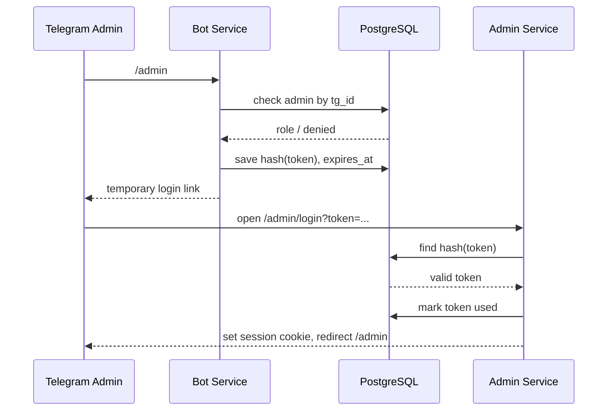

# OpenSpec-промпт для программиста: шаблон быстрого деплоя AI-ассистентов

## Назначение документа

Этот документ нужно передать программисту или кодовому агенту как техническое задание в формате OpenSpec.

Цель: на базе проекта `dichenko/uz-stomatolog` создать переиспользуемый шаблон для быстрого деплоя Telegram AI-ассистентов с LangChain, несколькими tools, отдельной веб-админкой, PostgreSQL, Docker Compose и внешним Caddy на сервере.

---

# PROMPT ДЛЯ ПРОГРАММИСТА / КОДОВОГО АГЕНТА

Ты senior Python/fullstack-разработчик.  
Твоя задача — превратить текущий проект `dichenko/uz-stomatolog` в reusable template для быстрого запуска новых Telegram AI-ассистентов.

Работай в стиле OpenSpec: сначала создай change proposal, затем requirements/specs, затем tasks/checklist, затем реализуй код по этим требованиям.

Проект должен остаться простым для копирования на новый VPS/домен/бота. Один такой шаблон должен позволять быстро поднять нового AI-ассистента с отдельной БД, отдельной админкой, отдельными env-настройками и своим Telegram-ботом.

---

## 1. Context

Исходный проект уже содержит полезную базу:

- Python 3.12.
- FastAPI как HTTP entrypoint для health checks и Telegram webhook.
- PostgreSQL 16.
- Docker Compose.
- Pydantic Settings.
- Structured JSON logs.
- LangGraph/LangChain-подход к агенту и tools.
- Telegram bot integration.
- Alembic migrations.
- Caddy снаружи Docker как reverse proxy.

Нужно сохранить подход monorepo, но сделать структуру более универсальной.

---

## 2. Goal

Создать шаблон проекта для AI-ассистентов:

```text
ai-assistant-template/
  apps/
    bot/
    admin/
  packages/
    shared/
  infra/
    docker-compose.yml
    Caddyfile.example
  migrations/
  scripts/
  openspec/
  .env.example
  README.md
```

Минимальный результат должен позволять:

1. Скопировать шаблон.
2. Заполнить `.env`.
3. Выбрать свободные host-порты для bot/admin.
4. Поднять сервисы через Docker Compose.
5. Настроить внешний Caddy.
6. Запустить Telegram-бота.
7. Через команду `/admin` получить временную ссылку в админку.
8. В админке редактировать системный промпт и инструкцию по tools.
9. Подключить несколько tools к LangChain-агенту.
10. Управлять администраторами и ролями.

---

# OpenSpec change

## change id

```text
create-ai-assistant-template
```

## proposal.md

```md
# Proposal: Create reusable AI assistant deployment template

## Summary

Создать reusable template для быстрого деплоя Telegram AI-ассистентов на базе существующего проекта `uz-stomatolog`.

Шаблон должен включать:

- Telegram bot service.
- LangChain agent with multiple tools.
- Separate admin web service.
- PostgreSQL database.
- Alembic migrations.
- Docker Compose without Caddy inside containers.
- External host-level Caddy reverse proxy.
- Random/local configurable host ports for services.
- Admin access through Telegram `/admin` one-time temporary login links.
- Role-based admin management.
- Versioned editable system prompt.
- Versioned editable tools instruction.
- Restore last 3 prompt/tool-instruction versions.
- Audit log.
- LangSmith observability integration for tracing agent runs, LLM calls and tool calls.

## Why

Сейчас каждый новый AI-ассистент приходится собирать вручную: бот, БД, промпты, админка, доступы, Caddy, порты, деплой.

Нужен шаблон, который можно быстро копировать и разворачивать под разные проекты, не переписывая инфраструктуру с нуля.

## Non-goals

- Не делать визуальный конструктор tools.
- Не давать администраторам возможность исполнять произвольный код.
- Не делать multi-tenant SaaS внутри одного приложения.
- Не хранить секреты в БД.
- Не добавлять Caddy внутрь Docker Compose.
- Не делать сложную CRM.
- Не делать полноценную систему биллинга.

## Main architectural decision

Caddy работает на сервере один раз глобально.  
Каждый проект поднимает только свои контейнеры:

- `bot`
- `admin`
- `postgres`

Контейнеры пробрасывают порты только на `127.0.0.1`.

Caddy проксирует публичные домены на локальные порты конкретного проекта.

## Risks

- Если не сделать случайные/конфигурируемые порты, несколько проектов на одном сервере будут конфликтовать.
- Если хранить admin login token в открытом виде, временные ссылки станут небезопасными.
- Если редактируемый промпт полностью заменяет все системные правила, администратор может случайно сломать поведение агента.
- Если restore старого промпта перезаписывает текущую запись, потеряется история.
- Если root admin хранится только в БД, можно потерять доступ к админке.

## Success criteria

- Новый проект можно поднять на VPS за 10–20 минут после заполнения `.env`.
- Команда `/admin` присылает одноразовую ссылку в админку.
- Ссылка истекает и не может быть использована повторно.
- Root admin из `.env` всегда имеет superadmin-доступ.
- Superadmin может добавлять/удалять других админов.
- Read admin не может ничего менять.
- Write admin может редактировать prompts/tools instruction, но не может управлять админами.
- Superadmin может управлять админами.
- Все изменения prompts/tools instruction сохраняются как новые версии.
- Можно восстановить одну из последних трех версий.
- LangChain-агент получает активный system prompt + активную tools instruction при каждом запросе.
```

---

# Specs

## specs/assistant-template/spec.md

```md
# Assistant Template Specification

## ADDED Requirements

### Requirement: Project shall be reusable for multiple independent assistants

The system SHALL be structured as a reusable monorepo template for Telegram AI-assistants.

#### Scenario: Developer creates a new assistant from template

- GIVEN a fresh copy of the template
- WHEN the developer fills `.env` and starts Docker Compose
- THEN the bot, admin service and PostgreSQL SHALL start as an independent project

#### Scenario: Multiple projects run on one VPS

- GIVEN several assistant projects deployed on the same VPS
- WHEN each project has its own `.env`
- THEN services SHALL NOT conflict by container names, database volumes or host ports

### Requirement: Project shall expose separate bot and admin services

The system SHALL run the Telegram bot and admin panel as separate Docker services.

#### Scenario: Start services

- GIVEN Docker Compose configuration
- WHEN `docker compose up -d --build` is executed
- THEN services `bot`, `admin`, and `postgres` SHALL be started

### Requirement: Project shall use external Caddy

The system SHALL NOT run Caddy inside Docker Compose.

#### Scenario: Reverse proxy is configured

- GIVEN host-level Caddy is already installed on the VPS
- WHEN developer configures Caddyfile
- THEN public domains SHALL reverse proxy to `127.0.0.1:${BOT_HOST_PORT}` and `127.0.0.1:${ADMIN_HOST_PORT}`

### Requirement: Host ports shall be configurable and safe for multi-project deployment

The system SHALL read host ports from `.env`.

Required variables:

```env
BOT_HOST_PORT=
ADMIN_HOST_PORT=
```

#### Scenario: Admin port is randomized

- GIVEN a developer initializes a new project
- WHEN the init script is executed
- THEN the script SHALL generate a random free `ADMIN_HOST_PORT`
- AND write it into `.env`

#### Scenario: Port binding is local only

- GIVEN services are started
- WHEN Docker publishes ports
- THEN ports SHALL be bound to `127.0.0.1`, not `0.0.0.0`

Example:

```yaml
ports:
  - "127.0.0.1:${ADMIN_HOST_PORT}:8080"
```

### Requirement: Template shall include deployment documentation

The system SHALL include README instructions for:

- local startup;
- VPS deployment;
- `.env` setup;
- port generation;
- Caddy configuration;
- migrations;
- Telegram bot token setup;
- admin login flow.
```

---

## specs/admin-access/spec.md

```md
# Admin Access Specification

## ADDED Requirements

### Requirement: Root admin shall be configured through env

The system SHALL have one main root admin configured through `.env`.

Required variable:

```env
ROOT_ADMIN_TG_ID=
```

The root admin SHALL always have `superadmin` permissions, even if DB records are missing or broken.

#### Scenario: Root admin starts the bot

- GIVEN `ROOT_ADMIN_TG_ID` is set
- WHEN this Telegram user sends `/admin`
- THEN the bot SHALL create a temporary admin login link

#### Scenario: Non-admin requests admin access

- GIVEN a Telegram user is not root admin and is not active in the admins table
- WHEN this user sends `/admin`
- THEN the bot SHALL deny access without creating a token

### Requirement: Admin access shall use temporary one-time links

The system SHALL authenticate admins via one-time temporary login links generated by Telegram command `/admin`.

#### Scenario: Admin requests link

- GIVEN an active admin sends `/admin`
- WHEN the bot receives the command
- THEN the bot SHALL create a random secure token
- AND store only the token hash in DB
- AND send a URL to the user in Telegram

Example URL:

```text
https://admin.example.com/admin/login?token=<one-time-token>
```

#### Scenario: Admin opens valid link

- GIVEN the token exists, is not expired, and is not used
- WHEN admin opens the link
- THEN admin service SHALL create an HTTP session
- AND mark token as used
- AND redirect admin to dashboard

#### Scenario: Admin opens expired link

- GIVEN token is expired
- WHEN admin opens the link
- THEN admin service SHALL reject login

#### Scenario: Admin reuses link

- GIVEN token was already used
- WHEN admin opens the link again
- THEN admin service SHALL reject login

### Requirement: Login tokens shall be secure

The system SHALL NOT store raw login tokens in DB.

Token requirements:

- generated with cryptographically secure random;
- minimum 32 bytes entropy;
- stored as SHA-256 hash or stronger;
- expires after `ADMIN_LOGIN_TOKEN_TTL_MINUTES`;
- single-use only.

Required env:

```env
ADMIN_LOGIN_TOKEN_TTL_MINUTES=15
SESSION_SECRET=
SESSION_COOKIE_NAME=
SESSION_COOKIE_SECURE=true
SESSION_COOKIE_SAMESITE=lax
```

### Requirement: Admin roles shall be supported

The system SHALL support three roles:

```text
read
write
superadmin
```

Permissions:

| Role | View prompts | Edit prompts | Restore versions | View admins | Add/remove admins |
|---|---:|---:|---:|---:|---:|
| read | yes | no | no | yes | no |
| write | yes | yes | yes | yes | no |
| superadmin | yes | yes | yes | yes | yes |

#### Scenario: Read admin attempts edit

- GIVEN admin has role `read`
- WHEN admin submits prompt changes
- THEN system SHALL reject the action with 403

#### Scenario: Write admin edits prompt

- GIVEN admin has role `write`
- WHEN admin saves a new prompt
- THEN system SHALL create a new prompt version

#### Scenario: Write admin tries to add admin

- GIVEN admin has role `write`
- WHEN admin tries to add another admin
- THEN system SHALL reject the action with 403

#### Scenario: Superadmin adds admin

- GIVEN admin has role `superadmin`
- WHEN admin adds a Telegram user ID with role `read` or `write` or `superadmin`
- THEN system SHALL create or update the admin record
```

---

## specs/prompt-versioning/spec.md

```md
# Prompt Versioning Specification

## ADDED Requirements

### Requirement: System prompt shall be editable from admin panel

The system SHALL store the active system prompt in DB.

#### Scenario: Admin opens prompt page

- GIVEN admin has at least `read` role
- WHEN admin opens "System Prompt"
- THEN admin SHALL see the active prompt content
- AND metadata: version, author, created date

#### Scenario: Admin saves prompt

- GIVEN admin has `write` or `superadmin` role
- WHEN admin edits and saves system prompt
- THEN system SHALL create a new prompt version
- AND mark it as active
- AND keep all previous versions

### Requirement: Old system prompts shall be preserved

The system SHALL never overwrite old prompt versions.

Prompt version record SHALL include:

- id;
- kind = `system_prompt`;
- content;
- version number;
- active flag;
- created_by_admin_id;
- created_by_tg_id;
- created_by_username;
- created_at;
- change_note optional.

### Requirement: Last three system prompts shall be restorable

The admin panel SHALL show the last three previous system prompt versions.

#### Scenario: Admin restores previous system prompt

- GIVEN admin has `write` or `superadmin` role
- WHEN admin clicks restore on one of the last three versions
- THEN system SHALL create a new active version copied from selected old version
- AND record who restored it and when
- AND old versions SHALL remain unchanged

### Requirement: Tools instruction shall be editable and versioned

The system SHALL store tools instruction separately from system prompt.

Tools instruction record SHALL use the same versioning mechanism with:

```text
kind = tools_instruction
```

#### Scenario: Admin edits tools instruction

- GIVEN admin has `write` or `superadmin` role
- WHEN admin saves tools instruction
- THEN system SHALL create a new active tools instruction version

#### Scenario: Admin restores previous tools instruction

- GIVEN admin has `write` or `superadmin` role
- WHEN admin restores one of the last three tools instruction versions
- THEN system SHALL create a new active version copied from selected version

### Requirement: Prompt assembly shall include tools instruction

The system SHALL concatenate active system prompt and active tools instruction for every agent request.

Required order:

```text
<non-editable core guardrails>

<active system prompt from DB>

# Tools usage instruction

<active tools instruction from DB>
```

#### Scenario: User sends message

- GIVEN active system prompt and active tools instruction exist
- WHEN bot handles user message
- THEN LangChain agent SHALL receive the assembled system message

### Requirement: Missing prompts shall have safe defaults

The system SHALL seed default prompt versions during initial setup or first startup.

#### Scenario: Empty DB

- GIVEN prompt_versions table is empty
- WHEN app starts
- THEN system SHALL insert default active system prompt
- AND default active tools instruction
```

---

## specs/langchain-tools/spec.md

```md
# LangChain Tools Specification

## ADDED Requirements

### Requirement: Bot shall use LangChain agent with registered tools

The system SHALL use LangChain-compatible tools.

Minimum template tools:

1. `send_admin_notification`
2. `save_lead`
3. `get_project_knowledge`
4. `create_followup_task`

Tools may be stubs but MUST demonstrate the pattern for future projects.

### Requirement: Tools shall be defined in code, not in admin panel

The system SHALL NOT allow admins to create arbitrary executable tools from the web UI.

Admin panel can only edit natural language instructions on how the agent should use existing tools.

#### Scenario: Admin changes tools instruction

- GIVEN a tool exists in code
- WHEN admin changes tools instruction
- THEN agent behavior may change
- BUT executable tool implementation SHALL remain unchanged

### Requirement: Tool calls shall be logged

The system SHALL log every tool call.

Tool call log SHALL include:

- trace_id;
- user_tg_id;
- tool_name;
- tool_input JSON;
- tool_output summary;
- status;
- error;
- duration_ms;
- created_at.

### Requirement: Agent requests shall have trace IDs

Every user message processed by the agent SHALL have a trace ID.

Trace ID SHALL be included in:

- application logs;
- agent execution logs;
- tool call logs;
- admin-visible debug view if implemented.
```

---

## specs/admin-panel/spec.md

```md
# Admin Panel Specification

## ADDED Requirements

### Requirement: Admin panel shall be a separate web service

The system SHALL provide admin panel as a separate service `admin`.

Admin service SHALL have its own Docker container and listen internally on port `8080`.

### Requirement: Admin panel shall provide three MVP sections

Admin panel SHALL include:

1. System Prompt
2. Tools Instruction
3. Administrators

### Requirement: System Prompt page

System Prompt page SHALL allow:

- view active system prompt;
- edit active system prompt for `write` and `superadmin`;
- save new version;
- view last three previous versions;
- restore one of last three versions;
- see who saved each version and when.

### Requirement: Tools Instruction page

Tools Instruction page SHALL allow:

- view active tools instruction;
- edit active tools instruction for `write` and `superadmin`;
- save new version;
- view last three previous versions;
- restore one of last three versions;
- see who saved each version and when.

### Requirement: Administrators page

Administrators page SHALL allow:

- view admins for all roles;
- add admin by Telegram ID;
- optionally store username/display name;
- choose role: read/write/superadmin;
- deactivate/delete admin;
- change admin role.

Only `superadmin` SHALL be allowed to add, delete, deactivate or change roles.

### Requirement: Admin panel shall have basic UI

For speed and simplicity use one of these options:

Preferred:

```text
FastAPI + Jinja2 + HTMX
```

Alternative:

```text
FastAPI API + React/Vite frontend
```

Choose the simpler option unless there is a strong reason to use React.

### Requirement: Admin panel shall have health endpoint

Admin service SHALL expose:

```http
GET /health
```

Expected response:

```json
{"status":"OK","service":"admin"}
```
```

---

## specs/database/spec.md

```md
# Database Specification

## ADDED Requirements

### Requirement: Database shall store admins

Create table `admins`.

Suggested fields:

```sql
id UUID PRIMARY KEY
tg_id BIGINT NOT NULL UNIQUE
username TEXT NULL
display_name TEXT NULL
role TEXT NOT NULL CHECK (role IN ('read', 'write', 'superadmin'))
is_active BOOLEAN NOT NULL DEFAULT TRUE
created_by_admin_id UUID NULL REFERENCES admins(id)
created_at TIMESTAMPTZ NOT NULL DEFAULT now()
updated_at TIMESTAMPTZ NOT NULL DEFAULT now()
deactivated_by_admin_id UUID NULL REFERENCES admins(id)
deactivated_at TIMESTAMPTZ NULL
```

### Requirement: Database shall store admin login tokens

Create table `admin_login_tokens`.

Suggested fields:

```sql
id UUID PRIMARY KEY
admin_tg_id BIGINT NOT NULL
token_hash TEXT NOT NULL UNIQUE
expires_at TIMESTAMPTZ NOT NULL
used_at TIMESTAMPTZ NULL
created_at TIMESTAMPTZ NOT NULL DEFAULT now()
ip_address INET NULL
user_agent TEXT NULL
```

### Requirement: Database shall store prompt versions

Create table `prompt_versions`.

Suggested fields:

```sql
id UUID PRIMARY KEY
kind TEXT NOT NULL CHECK (kind IN ('system_prompt', 'tools_instruction'))
version_number INTEGER NOT NULL
content TEXT NOT NULL
is_active BOOLEAN NOT NULL DEFAULT FALSE
created_by_admin_id UUID NULL REFERENCES admins(id)
created_by_tg_id BIGINT NULL
created_by_username TEXT NULL
change_note TEXT NULL
restored_from_version_id UUID NULL REFERENCES prompt_versions(id)
created_at TIMESTAMPTZ NOT NULL DEFAULT now()
```

Constraints:

```sql
UNIQUE(kind, version_number)
```

Only one active version per kind should exist. Implement either with partial unique index or transaction logic.

### Requirement: Database shall store audit log

Create table `admin_audit_log`.

Suggested fields:

```sql
id UUID PRIMARY KEY
admin_id UUID NULL REFERENCES admins(id)
admin_tg_id BIGINT NULL
action TEXT NOT NULL
entity_type TEXT NOT NULL
entity_id UUID NULL
metadata JSONB NOT NULL DEFAULT '{}'::jsonb
created_at TIMESTAMPTZ NOT NULL DEFAULT now()
ip_address INET NULL
user_agent TEXT NULL
```

Required audit actions:

- `admin.login_link_created`
- `admin.login_success`
- `admin.login_failed`
- `prompt.created`
- `prompt.restored`
- `tools_instruction.created`
- `tools_instruction.restored`
- `admin.created`
- `admin.role_changed`
- `admin.deactivated`
```

---

## specs/docker-deployment/spec.md

```md
# Docker Deployment Specification

## ADDED Requirements

### Requirement: Docker Compose shall run app services

Docker Compose SHALL include:

- `bot`
- `admin`
- `postgres`

Optional later:

- `worker`
- `redis`

### Requirement: Services shall use project-specific container names implicitly

Do NOT hardcode global container names.

Use Docker Compose project name from env or directory name.

Required env:

```env
COMPOSE_PROJECT_NAME=
PROJECT_SLUG=
```

### Requirement: Postgres volume shall be project-specific

Volume name SHALL be scoped by Docker Compose project name.

Example:

```yaml
volumes:
  postgres_data:
```

Do not use global volume names like `postgres_data_global`.

### Requirement: Compose shall bind only localhost ports

Example:

```yaml
services:
  bot:
    ports:
      - "127.0.0.1:${BOT_HOST_PORT}:8000"

  admin:
    ports:
      - "127.0.0.1:${ADMIN_HOST_PORT}:8080"
```

### Requirement: Env example shall include all required variables

`.env.example` SHALL include:

```env
APP_ENV=dev
APP_TIMEZONE=Europe/Tallinn
PROJECT_SLUG=ai-assistant-template
COMPOSE_PROJECT_NAME=ai-assistant-template

BOT_PUBLIC_URL=https://bot.example.com
ADMIN_PUBLIC_URL=https://admin.example.com

BOT_HOST_PORT=18001
ADMIN_HOST_PORT=18002

TELEGRAM_BOT_TOKEN=
TELEGRAM_WEBHOOK_SECRET=
BOT_MODE=polling

ROOT_ADMIN_TG_ID=
ADMIN_LOGIN_TOKEN_TTL_MINUTES=15

POSTGRES_HOST=postgres
POSTGRES_PORT=5432
POSTGRES_DB=assistant
POSTGRES_USER=assistant
POSTGRES_PASSWORD=change_me

TEXT_LLM_PROVIDER=openai
OPENAI_API_KEY=
OPENAI_BASE_URL=https://api.openai.com/v1
OPENAI_TEXT_MODEL=gpt-4.1-mini

LANGSMITH_TRACING=false
LANGSMITH_API_KEY=
LANGSMITH_ENDPOINT=https://api.smith.langchain.com
LANGSMITH_PROJECT=ai-assistant-template
LANGSMITH_WORKSPACE_ID=
LANGSMITH_TAGS=telegram,production
LANGSMITH_SAMPLE_RATE=1.0

SESSION_SECRET=
SESSION_COOKIE_NAME=assistant_admin_session
SESSION_COOKIE_SECURE=true
SESSION_COOKIE_SAMESITE=lax
```

### Requirement: Template shall include Caddyfile example

Example:

```caddyfile
bot.example.com {
    reverse_proxy 127.0.0.1:18001
}

admin.example.com {
    reverse_proxy 127.0.0.1:18002
}
```

### Requirement: Template shall include init script for ports

Create script:

```text
scripts/init_project_env.py
```

Script responsibilities:

- copy `.env.example` to `.env` if `.env` does not exist;
- generate `PROJECT_SLUG` if missing;
- generate random free `BOT_HOST_PORT`;
- generate random free `ADMIN_HOST_PORT`;
- generate `SESSION_SECRET`;
- print Caddyfile snippet.
```

---

## specs/langsmith-observability/spec.md

```md
# LangSmith Observability Specification

## ADDED Requirements

### Requirement: LangSmith tracing shall be supported

The system SHALL support optional LangSmith tracing for all LangChain/LangGraph agent executions.

Tracing SHALL be controlled through env variables and must not break the bot when disabled.

Required env:

```env
LANGSMITH_TRACING=false
LANGSMITH_API_KEY=
LANGSMITH_ENDPOINT=https://api.smith.langchain.com
LANGSMITH_PROJECT=ai-assistant-template
LANGSMITH_WORKSPACE_ID=
LANGSMITH_TAGS=telegram,production
LANGSMITH_SAMPLE_RATE=1.0
```

#### Scenario: LangSmith disabled

- GIVEN `LANGSMITH_TRACING=false`
- WHEN user sends a message to the bot
- THEN the agent SHALL work normally
- AND no LangSmith network call SHALL be required

#### Scenario: LangSmith enabled

- GIVEN `LANGSMITH_TRACING=true`
- AND `LANGSMITH_API_KEY` is configured
- WHEN the agent handles a user message
- THEN the full LangChain/LangGraph run SHALL be traced in LangSmith
- AND the trace SHALL be stored under `LANGSMITH_PROJECT`

### Requirement: LangSmith project name shall be project-specific

The system SHALL use a project-specific LangSmith project name.

Recommended default:

```env
LANGSMITH_PROJECT=${PROJECT_SLUG}
```

#### Scenario: Multiple assistants use LangSmith

- GIVEN multiple assistant projects are deployed
- WHEN each project has a different `PROJECT_SLUG`
- THEN their traces SHALL be separated into different LangSmith projects

### Requirement: LangSmith trace metadata shall include local trace_id

Every LangSmith root run SHALL include metadata that links it to local logs and DB records.

Required metadata:

```json
{
  "trace_id": "...",
  "project_slug": "...",
  "telegram_user_id": "...",
  "telegram_username": "...",
  "bot_mode": "polling|webhook",
  "prompt_version": 1,
  "tools_instruction_version": 1,
  "llm_provider": "openai|anthropic|...",
  "llm_model": "..."
}
```

#### Scenario: Debugging user request

- GIVEN an admin has a local `trace_id`
- WHEN developer opens LangSmith
- THEN developer SHALL be able to find the corresponding LangSmith run by metadata

### Requirement: LangSmith tags shall identify environment and assistant

Every LangSmith run SHALL include tags.

Recommended tags:

```text
project:<PROJECT_SLUG>
env:<APP_ENV>
channel:telegram
bot-mode:<BOT_MODE>
```

Additional tags from `LANGSMITH_TAGS` SHALL be appended.

### Requirement: LangSmith shall capture tool calls

The system SHALL ensure LangChain tool calls are visible in LangSmith traces.

#### Scenario: Agent calls tool

- GIVEN LangSmith tracing is enabled
- WHEN the agent calls `save_lead`
- THEN LangSmith trace SHALL show this tool call as a child run/span
- AND local `tool_call_logs` SHALL also store the call

### Requirement: LangSmith shall capture prompt versions

The system SHALL attach active prompt version numbers to traces.

Required fields:

- `system_prompt_version`;
- `tools_instruction_version`;
- `assembled_prompt_hash`.

Do NOT send secrets to metadata.

### Requirement: LangSmith integration shall avoid leaking secrets

The system SHALL NOT send secrets, raw env values, session cookies, admin login tokens or DB credentials into LangSmith metadata, tags, inputs, outputs or error messages.

#### Scenario: Tool receives secret

- GIVEN a tool internally uses an API key
- WHEN tracing is enabled
- THEN the API key SHALL NOT be included in tool input/output metadata

### Requirement: LangSmith shall be visible in admin debug page

The debug page `/admin/debug` SHALL show non-secret LangSmith status:

- tracing enabled/disabled;
- project name;
- endpoint host;
- workspace configured yes/no;
- last successful trace timestamp if available;
- last tracing error if available, without secrets.

### Requirement: LangSmith failures shall not break user conversations

LangSmith integration SHALL be best-effort.

#### Scenario: LangSmith API unavailable

- GIVEN tracing is enabled
- WHEN LangSmith API is unavailable or returns error
- THEN user conversation SHALL continue
- AND app logs SHALL record tracing error
- AND admin debug page SHALL show last tracing error
```

---

# Implementation tasks

## tasks.md

```md
# Tasks: create-ai-assistant-template

## 1. Repository structure

- [ ] Refactor repository into reusable monorepo structure:
  - [ ] `apps/bot`
  - [ ] `apps/admin`
  - [ ] `packages/shared`
  - [ ] `infra`
  - [ ] `scripts`
  - [ ] `openspec`
- [ ] Keep existing working bot patterns from `uz-stomatolog`.
- [ ] Remove hardcoded dental-clinic names from core template.
- [ ] Move project-specific examples into sample prompts/knowledge files.

## 2. Configuration

- [ ] Create/refresh `.env.example`.
- [ ] Add `ROOT_ADMIN_TG_ID`.
- [ ] Add `ADMIN_PUBLIC_URL`.
- [ ] Add `BOT_HOST_PORT`.
- [ ] Add `ADMIN_HOST_PORT`.
- [ ] Add `PROJECT_SLUG`.
- [ ] Add `COMPOSE_PROJECT_NAME`.
- [ ] Add session settings.
- [ ] Add admin login token TTL.

## 3. Docker

- [ ] Update `infra/docker-compose.yml`.
- [ ] Add `bot` service.
- [ ] Add `admin` service.
- [ ] Add `postgres` service.
- [ ] Bind ports only to `127.0.0.1`.
- [ ] Do not include Caddy container.
- [ ] Add healthchecks where useful.
- [ ] Make service names and volumes safe for multiple projects.

## 4. Caddy

- [ ] Create `infra/Caddyfile.example`.
- [ ] Include bot domain reverse proxy.
- [ ] Include admin domain reverse proxy.
- [ ] Document that Caddy is installed globally on host.

## 5. Database migrations

- [ ] Create Alembic migration for `admins`.
- [ ] Create Alembic migration for `admin_login_tokens`.
- [ ] Create Alembic migration for `prompt_versions`.
- [ ] Create Alembic migration for `admin_audit_log`.
- [ ] Create optional tables for agent runs/tool calls if not already present.
- [ ] Add indexes:
  - [ ] `admins.tg_id`
  - [ ] `admin_login_tokens.token_hash`
  - [ ] `admin_login_tokens.expires_at`
  - [ ] `prompt_versions.kind`
  - [ ] active prompt lookup
  - [ ] audit log by admin/date

## 6. Root admin bootstrap

- [ ] On app startup, read `ROOT_ADMIN_TG_ID`.
- [ ] Ensure this tg_id always resolves to role `superadmin`.
- [ ] If admins table does not contain root admin, insert it.
- [ ] If DB role differs, root admin must still be treated as `superadmin`.

## 7. Telegram `/admin` command

- [ ] Add `/admin` handler in bot.
- [ ] Check if user is root admin or active admin.
- [ ] If user is not admin, deny access.
- [ ] If user is admin:
  - [ ] generate secure random token;
  - [ ] hash token before DB save;
  - [ ] store token hash with expiration;
  - [ ] send `ADMIN_PUBLIC_URL/admin/login?token=...` to Telegram user.
- [ ] Log audit event `admin.login_link_created`.

## 8. Admin authentication

- [ ] Implement `GET /admin/login?token=...`.
- [ ] Hash incoming token and find DB record.
- [ ] Reject missing/expired/used token.
- [ ] Mark token as used.
- [ ] Create signed session cookie.
- [ ] Redirect to `/admin`.
- [ ] Implement logout.
- [ ] Protect all admin routes.
- [ ] Add CSRF protection for POST forms.

## 9. Admin UI

- [ ] Build admin UI as separate service.
- [ ] Preferred stack: FastAPI + Jinja2 + HTMX.
- [ ] Add layout:
  - [ ] sidebar/nav;
  - [ ] current admin identity;
  - [ ] role badge;
  - [ ] logout button.
- [ ] Add `/health`.

## 10. System prompt management

- [ ] Page `/admin/system-prompt`.
- [ ] Show active prompt.
- [ ] Show metadata: version, saved by, date.
- [ ] Allow edit only for `write` and `superadmin`.
- [ ] Saving creates new version.
- [ ] Previous versions remain unchanged.
- [ ] Show last 3 previous versions.
- [ ] Restore creates a new active version copied from selected version.
- [ ] Log audit events.

## 11. Tools instruction management

- [ ] Page `/admin/tools-instruction`.
- [ ] Same behavior as system prompt.
- [ ] Store as `kind=tools_instruction`.
- [ ] Saving creates new version.
- [ ] Restore creates new active version.
- [ ] Log audit events.

## 12. Admin management

- [ ] Page `/admin/admins`.
- [ ] Visible to all admins.
- [ ] Add admin form visible only to `superadmin`.
- [ ] Role change allowed only to `superadmin`.
- [ ] Deactivate/delete allowed only to `superadmin`.
- [ ] Prevent superadmin from accidentally removing root admin.
- [ ] Log audit events.

## 13. Prompt assembly

- [ ] Create prompt service/repository.
- [ ] Load active `system_prompt`.
- [ ] Load active `tools_instruction`.
- [ ] Concatenate on every agent request:
  - [ ] non-editable core guardrails;
  - [ ] active system prompt;
  - [ ] tools instruction heading;
  - [ ] active tools instruction.
- [ ] Add fallback defaults if DB is empty.
- [ ] Add tests for prompt assembly.

## 14. LangChain agent

- [ ] Implement LangChain agent with tool calling.
- [ ] Register at least 4 template tools:
  - [ ] `send_admin_notification`
  - [ ] `save_lead`
  - [ ] `get_project_knowledge`
  - [ ] `create_followup_task`
- [ ] Add clear code pattern for adding new tools.
- [ ] Add tool call logging.
- [ ] Add trace ID to each user message processing flow.

## 15. LangSmith observability

- [ ] Add LangSmith dependencies if missing.
- [ ] Add env support:
  - [ ] `LANGSMITH_TRACING`
  - [ ] `LANGSMITH_API_KEY`
  - [ ] `LANGSMITH_ENDPOINT`
  - [ ] `LANGSMITH_PROJECT`
  - [ ] `LANGSMITH_WORKSPACE_ID`
  - [ ] `LANGSMITH_TAGS`
  - [ ] `LANGSMITH_SAMPLE_RATE`
- [ ] When `LANGSMITH_TRACING=false`, app must work without LangSmith API key.
- [ ] When `LANGSMITH_TRACING=true`, LangChain/LangGraph runs must be traced.
- [ ] Set LangSmith project from `LANGSMITH_PROJECT`, defaulting to `PROJECT_SLUG`.
- [ ] Add local `trace_id` to LangSmith metadata.
- [ ] Add prompt version metadata:
  - [ ] `system_prompt_version`
  - [ ] `tools_instruction_version`
  - [ ] `assembled_prompt_hash`
- [ ] Add runtime metadata:
  - [ ] `project_slug`
  - [ ] `app_env`
  - [ ] `telegram_user_id`
  - [ ] `telegram_username`
  - [ ] `bot_mode`
  - [ ] `llm_provider`
  - [ ] `llm_model`
- [ ] Add tags:
  - [ ] `project:<PROJECT_SLUG>`
  - [ ] `env:<APP_ENV>`
  - [ ] `channel:telegram`
  - [ ] `bot-mode:<BOT_MODE>`
- [ ] Ensure tool calls appear as child spans/runs in LangSmith.
- [ ] Ensure secrets/tokens/cookies/API keys are never sent to LangSmith.
- [ ] Add graceful degradation if LangSmith API is unavailable.
- [ ] Add LangSmith status to `/admin/debug`.
- [ ] Add README section: how to enable LangSmith and find traces by `trace_id`.

## 16. Seed data

- [ ] Add default system prompt.
- [ ] Add default tools instruction.
- [ ] Add sample project knowledge.
- [ ] Seed on first startup or via explicit command.

## 17. Scripts

- [ ] Create `scripts/init_project_env.py`.
- [ ] Script should generate random free local ports.
- [ ] Script should generate `SESSION_SECRET`.
- [ ] Script should print Caddyfile snippet.
- [ ] Add usage to README.

## 18. Tests

- [ ] Test admin role permissions.
- [ ] Test `/admin` access allowed/denied.
- [ ] Test token expiration.
- [ ] Test token single-use.
- [ ] Test prompt version creation.
- [ ] Test restore creates new version.
- [ ] Test prompt assembly includes tools instruction.
- [ ] Test LangSmith disabled mode works without API key.
- [ ] Test LangSmith enabled mode attaches trace_id metadata.
- [ ] Test LangSmith tracing failure does not break user conversation.
- [ ] Test secrets are not included in LangSmith metadata.
- [ ] Test non-admin cannot access admin panel.
- [ ] Test read admin cannot write.
- [ ] Test write admin cannot manage admins.

## 19. Documentation

- [ ] Update README.
- [ ] Add local development guide.
- [ ] Add VPS deployment guide.
- [ ] Add Caddy setup guide.
- [ ] Add "How to create a new assistant from template".
- [ ] Add "How to add a new tool".
- [ ] Add "How admin access works".
- [ ] Add "How prompt versioning works".
- [ ] Add "How to enable LangSmith tracing".
- [ ] Add "How to search LangSmith traces by local trace_id".
```

---

# Recommended implementation details

## Suggested runtime stack

Use this unless there is a reason not to:

```text
Python 3.12
FastAPI
aiogram 3
LangChain
PostgreSQL 16
SQLAlchemy 2 async
Alembic
Pydantic Settings
Jinja2 + HTMX for admin UI
Docker Compose
Host-level Caddy
```

Why Jinja2 + HTMX for admin: faster MVP, fewer moving parts, no separate Node build, enough for forms/tables/version restore.

---

## Suggested Docker Compose shape

```yaml
services:
  bot:
    build:
      context: ../apps/bot
      dockerfile: Dockerfile
    env_file:
      - path: ../.env
        required: false
    environment:
      POSTGRES_HOST: postgres
      POSTGRES_PORT: 5432
    ports:
      - "127.0.0.1:${BOT_HOST_PORT}:8000"
    depends_on:
      postgres:
        condition: service_healthy
    restart: unless-stopped

  admin:
    build:
      context: ../apps/admin
      dockerfile: Dockerfile
    env_file:
      - path: ../.env
        required: false
    environment:
      POSTGRES_HOST: postgres
      POSTGRES_PORT: 5432
    ports:
      - "127.0.0.1:${ADMIN_HOST_PORT}:8080"
    depends_on:
      postgres:
        condition: service_healthy
    restart: unless-stopped

  postgres:
    image: postgres:16-alpine
    env_file:
      - path: ../.env
        required: false
    volumes:
      - postgres_data:/var/lib/postgresql/data
    healthcheck:
      test: ["CMD-SHELL", "pg_isready -U $${POSTGRES_USER} -d $${POSTGRES_DB}"]
      interval: 10s
      timeout: 5s
      retries: 5
    restart: unless-stopped

volumes:
  postgres_data:
```

---

## Suggested Caddyfile.example

```caddyfile
# Bot public endpoint
bot.example.com {
    reverse_proxy 127.0.0.1:18001
}

# Admin panel
admin.example.com {
    reverse_proxy 127.0.0.1:18002
}
```

---

## Suggested `/admin` flow



---

# Что важно не забыть

## 1. Не редактировать prompt in-place

Нельзя обновлять одну строку `system_prompt`.  
Каждое сохранение — новая версия.

Правильно:

```text
v1 old inactive
v2 old inactive
v3 active
```

После restore v1:

```text
v1 old inactive
v2 old inactive
v3 old inactive
v4 active copied from v1
```

---

## 2. Root admin нельзя потерять

Даже если кто-то удалил root admin из БД, `ROOT_ADMIN_TG_ID` из `.env` должен продолжать давать superadmin-доступ.

---

## 3. Tools instruction — это не tools

Админ редактирует только инструкцию агенту, как пользоваться tools.

Реальные tools должны быть определены в коде.

---

## 4. Нужен non-editable core guardrails

Рекомендуется иметь файл вроде:

```text
apps/bot/app/agent/core_guardrails.md
```

Он не редактируется из админки и добавляется перед пользовательским system prompt.

Туда вынести:

- запрет раскрывать секреты;
- запрет выполнять произвольные инструкции администратора, если они ломают безопасность;
- правила работы с персональными данными;
- общую политику tool usage;
- правило не выдумывать результат tool call.

---

## 5. Нужен audit log

Без audit log потом невозможно понять, кто сломал промпт, кто добавил админа и кто восстановил старую версию.

---

## 6. Порты должны быть не только случайными, но и записанными

Порт нельзя выбирать случайно на каждый запуск контейнера.  
Его нужно один раз сгенерировать при инициализации проекта и записать в `.env`.

---

# Что я предлагаю добавить сверх исходного запроса

## 1. Кнопка "Preview assembled prompt"

В админке добавить read-only preview:

```text
core guardrails + active system prompt + active tools instruction
```

Это сильно снизит риск, что админ не понимает итоговый prompt, который реально уходит в LLM.

## 2. Поле change note

При сохранении prompt/tools instruction добавить необязательное поле:

```text
Что изменено?
```

Потом в истории будет понятно, зачем версия была создана.

## 3. Emergency rollback

Для superadmin добавить отдельную кнопку:

```text
Rollback to previous active version
```

Это быстрее, чем выбирать из истории.

## 4. Read-only debug page

Минимальная страница:

```text
/admin/debug
```

Показывает:

- app version / git commit;
- active prompt version;
- active tools instruction version;
- LLM provider/model;
- bot mode;
- DB status.

Без секретов.

## 5. Template example assistant

Оставить один демо-ассистент:

```text
"AI assistant for collecting user requests"
```

С простым поведением:

- отвечает пользователю;
- собирает имя/контакт/запрос;
- вызывает `save_lead`;
- вызывает `send_admin_notification`.

Это даст программисту и будущим проектам понятный reference flow.

---

## Suggested LangSmith integration pattern

Use LangSmith as optional observability, not as a hard runtime dependency.

Recommended behavior:

```python
# Pseudocode

metadata = {
    "trace_id": trace_id,
    "project_slug": settings.PROJECT_SLUG,
    "app_env": settings.APP_ENV,
    "telegram_user_id": str(user.tg_id),
    "telegram_username": user.username,
    "bot_mode": settings.BOT_MODE,
    "system_prompt_version": active_system_prompt.version_number,
    "tools_instruction_version": active_tools_instruction.version_number,
    "assembled_prompt_hash": assembled_prompt_hash,
    "llm_provider": settings.TEXT_LLM_PROVIDER,
    "llm_model": settings.TEXT_LLM_MODEL,
}

tags = [
    f"project:{settings.PROJECT_SLUG}",
    f"env:{settings.APP_ENV}",
    "channel:telegram",
    f"bot-mode:{settings.BOT_MODE}",
] + settings.LANGSMITH_TAGS_LIST

agent.invoke(
    agent_input,
    config={
        "run_name": "telegram_assistant_turn",
        "metadata": metadata,
        "tags": tags,
    },
)
```

Important:

- Do not put full user message history into metadata.
- Do not put API keys, cookies, admin tokens or DB URLs into metadata.
- Keep local DB logs even when LangSmith is enabled.
- LangSmith is for debugging and observability; local DB remains the source of truth for admin/audit/tool logs.
- If `LANGSMITH_SAMPLE_RATE < 1.0`, trace only part of conversations, but always keep local logs.


---

# Acceptance checklist

Перед сдачей программист должен показать:

- [ ] Новый проект стартует через Docker Compose.
- [ ] Bot health endpoint работает.
- [ ] Admin health endpoint работает.
- [ ] Caddy проксирует bot/admin домены на разные localhost-порты.
- [ ] `/admin` работает для root admin.
- [ ] `/admin` не работает для обычного пользователя.
- [ ] Временная ссылка истекает.
- [ ] Временная ссылка одноразовая.
- [ ] Root admin может добавить read/write/superadmin.
- [ ] Read admin не может редактировать.
- [ ] Write admin может менять prompts, но не admins.
- [ ] Superadmin может управлять admins.
- [ ] System prompt сохраняется версиями.
- [ ] Tools instruction сохраняется версиями.
- [ ] Restore создает новую версию, а не перезаписывает старую.
- [ ] Agent получает system prompt + tools instruction при каждом запросе.
- [ ] Tool calls логируются.
- [ ] При `LANGSMITH_TRACING=false` ассистент работает без LangSmith.
- [ ] При `LANGSMITH_TRACING=true` agent run появляется в LangSmith.
- [ ] В LangSmith trace есть metadata с локальным `trace_id`.
- [ ] Tool calls видны и локально в БД, и в LangSmith trace.
- [ ] Секреты не попадают в LangSmith metadata/tags.
- [ ] README содержит понятную инструкцию запуска нового ассистента.
